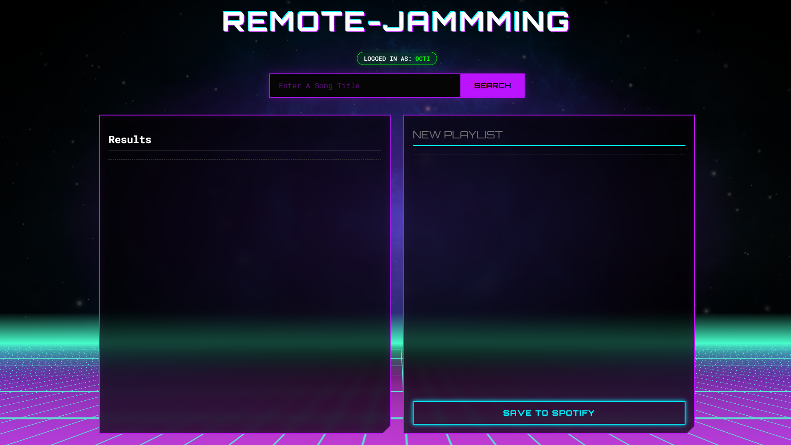

# 🎵 Jammming (Cyberpunk Edition)

**Jammming** is a web application that interfaces with the Spotify API to allow users to search for music, build custom playlists, and save them directly to their Spotify account.

**Live Demo:** [https://dev.ningun.eu](https://dev.ningun.eu)

---

## Screenshot



## Project Status

This project is feature-complete. 

### Implemented Features

* **Secure Authentication (PKCE):** Implemented **Authorization Code with PKCE**.
* **Live Spotify Search:** Users can search for any track in the Spotify library.
* **Playlist Management:** Users can **Add** and **Remove** tracks from a custom playlist state.
* **Custom Playlist Naming:** Users can rename their playlist via an interactive input field before saving.
* **Save to Account:** Users can **save the playlist permanently** to the user's Spotify account.
* **User Profile Integration:** Fetches and displays the currently logged-in user's **Spotify Display Name** in a status badge.
* **Persistent Session:** Uses **LocalStorage** to save authentication tokens, preventing the app from forcing a re-login on every page refresh.
* **Cyberpunk UI:** A completely custom, responsive design featuring:
    * **Glassmorphism** panels with backdrop blurs.
    * **Neon Glow** effects and borders.
    * **Animated CSS Grid** background.
* **Remote Infrastructure:** Hosted and developed on a custom **AlmaLinux VPS** using **Nginx** as a reverse proxy and **code-server** for remote development.

---

## 🛠️ Architecture & Tech Stack

This project was built in a custom **Remote Development Environment**.

* **Framework:** [Next.js 15](https://nextjs.org/) (React)
* **Language:** TypeScript
* **Styling:** CSS Modules (Scoped styling)
* **Server:** AlmaLinux via Hetzner Cloud
* **Proxy:** Nginx Reverse Proxy (Handling SSL and sub-domain routing)
* **Security:** SELinux policies configured for secure web connections.

---

## 🚀 Getting Started (Local Dev)

To run this project on your own machine:

1.  **Clone the repository:**
    ```bash
    git clone [https://github.com/your-username/remote-jammming.git](https://github.com/your-username/remote-jammming.git)
    cd remote-jammming
    ```

2.  **Install dependencies:**
    ```bash
    npm install
    ```

3.  **Set Up Your Spotify API Client ID:**
    * Create a new file in the root of the project named `.env.local`.
    * Add your Client ID from the Spotify Dashboard to this file:
        ```env
        NEXT_PUBLIC_SPOTIFY_CLIENT_ID=your-client-id-goes-here
        ```
    * In your Spotify App settings, add the correct **Redirect URI** for your environment:
        * For local development: `http://localhost:3000/`
        * For production: `https://your-domain.com/`

4.  **Run the development server:**
    ```bash
    npm run dev
    ```
    Open [http://localhost:3000](http://localhost:3000) to view it.

---

## Acknowledgements

* **Spotify API:** For providing the music data and authentication services.
* **Codecademy:** For the project prompt and guidance.
* **Retro Background:** The 3D Grid animation was adapted from [dpkd's "Retro sci-fi grid"](https://codepen.io/dpkd/pen/NWVvjzO) on CodePen.